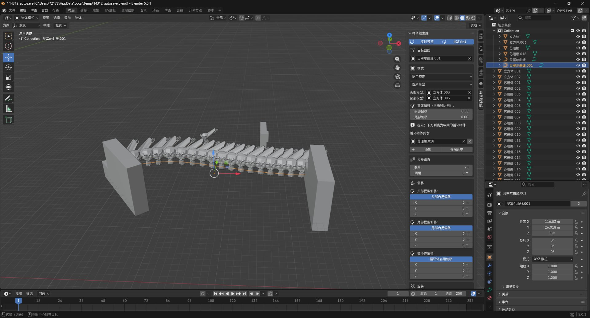

# Blender 样条线生成器

沿样条线实时生成物体的 Blender 插件，支持缩放、间距、旋转与首尾模型，可绑定曲线实时跟随。

## 功能特性

- **单一/多物体模式**：支持单一物体复制或多物体循环/随机排列
- **首尾模型**：可指定头部和尾部专用模型
- **实时预览**：参数调整即时更新
- **绑定曲线**：生成物体跟随曲线变形
- **随机变换**：支持随机旋转和缩放
- **局部偏移**：可沿物体局部轴向偏移

## 安装方法

1. 下载 `spline_object_generator.py`
2. 打开 Blender → 编辑 → 偏好设置 → 插件 → 安装
3. 选择下载的文件，勾选启用

## 使用方法

1. 在场景中选择一条曲线作为目标
2. 选择要复制的源物体（网格）
3. 在右侧边栏的「样条线生成」面板中调整参数
4. 点击「生成」按钮

## 文件说明

| 文件 | 说明 |
|------|------|
| `spline_object_generator.py` | 主插件文件（完整功能） |
| `gen_spline.py` | 简化版样条线生成 |
| `fix_offset.py` / `fix_step*.py` | 修复迭代版本 |

## 版本

- **v1.6.0** — 当前版本
- 兼容 Blender 4.0+
